# Mapa Arquitectonico Completo — Alpha Agent Terminal

Este documento proporciona una especificacion tecnica de extremo a extremo de la terminal, detallando las relaciones de componentes, el flujo de datos, el mapa de funciones de cada archivo, y la interaccion bidireccional con el Agente Antigravity.

---

## 1. Diagrama de Relaciones y Componentes (System Architecture)

El siguiente diagrama detalla como interactuan los diferentes modulos del sistema, desde la ingesta de archivos CSV locales hasta la visualizacion en el navegador y el puente agentico de IA:

```mermaid
graph TD
    %% Estilos de nodos
    classDef python fill:#f9f6ff,stroke:#8b5cf6,stroke-width:2px;
    classDef html fill:#eff6ff,stroke:#3b82f6,stroke-width:2px;
    classDef json fill:#fff7ed,stroke:#f97316,stroke-width:2px;
    classDef csv fill:#f0fdf4,stroke:#22c55e,stroke-width:2px;
    classDef agent fill:#fafaf9,stroke:#78716c,stroke-width:2px;

    %% Base de Datos Centralizada
    CSV_DATA[(data / CSV)]:::csv
  
    %% Modulo Backend (src/)
    subgraph Backend_Python [src/ - Python Engine]
        ENGINE[engine.py]:::python
        KPIS[kpis.py]:::python
        SERVER[server.py]:::python
        CONFIG[config.py]:::python
        GEN_ANA[generate_analysis.py]:::python
    end

    %% Modulo Frontend (frontend/)
    subgraph Frontend_Web [frontend/ - Client Side]
        DASH[dashboard_volatilidad.html]:::html
        ASSETS[assets/ qrt_logo]:::html
    end

    %% Canal de Comunicacion (bridge/)
    subgraph Sincronizacion_Bridge [bridge/ - JSON Sync]
        ESTADO[estado_dashboard.json]:::json
        REQ_3D[antigravity_bridge_request.json]:::json
        RES_3D[antigravity_bridge_response.json]:::json
    end

    %% Agente IDE (Antigravity)
    subgraph IDE_Agent [IDE Antigravity]
        AGENT_CORE[Antigravity AI Agent]:::agent
    end

    %% Relaciones de Ingesta y Calculo
    CSV_DATA -->|Lectura de CSVs| ENGINE
    ENGINE -->|Delegacion de Formulas Matematicas| KPIS
    ENGINE -->|Escribe Estado del Activo| ESTADO
    CONFIG -->|Rutas y Variables| ENGINE
    CONFIG -->|Rutas y Variables| SERVER
  
    %% Relaciones del Servidor API
    SERVER -->|Importa Metricas y Metodos| ENGINE
    SERVER -->|Sirve HTML y Recursos Estaticos| DASH
    SERVER -->|Sirve Logos PNG| ASSETS

    %% Relaciones de Consulta del Dashboard
    DASH -->|GET /api/volatility| SERVER
    DASH -->|GET /api/streaks| SERVER
    DASH -->|GET /api/gaps| SERVER
    DASH -->|POST /api/gaps/analyze_cell| SERVER
    DASH -->|POST /api/gaps/analyze_surface| SERVER
    DASH -->|GET /api/agent/read_bridge| SERVER

    %% Relaciones del Puente Agentico
    SERVER -->|Escribe Coordenadas 3D| REQ_3D
    SERVER -->|Lee Informe del Disco| RES_3D
    AGENT_CORE -->|Lee Contexto de Activo| ESTADO
    AGENT_CORE -->|Lee Peticion de Superficie| REQ_3D
    AGENT_CORE -->|Escribe Reporte Avanzado| RES_3D
```



---

## 2. Mapa Funcional del Repositorio

A continuacion se detallan todas las clases y funciones involucradas en cada arista del proyecto:

### 2.1 Backend: Motor Matematico y API

#### A. `src/kpis.py` (Modulo de Formulas)

* `calculate_atr(df, period=14)`: Calcula el Average True Range usando el promedio suavizado de Wilder.
* `calculate_natr(df)`: Normaliza el ATR dividiendolo por el precio de cierre, permitiendo comparar la volatilidad de activos con denominaciones distintas.
* `classify_regimes_full(df)`: Determina la volatilidad del NATR frente a su ventana movil de 120 dias, clasificandolo en los terciles BAJO, MEDIO y ALTO.
* `calculate_expansion_contraction(df)`: Evalua el estado del NATR respecto a su media para clasificar el mercado en fases de EXPANSION o CONTRACCION.
* `get_streak_metrics(df)`: Identifica periodos de volatilidad persistente (rachas) y calcula sus estadisticas (duraciones, drawdowns maximos, upswing y downswings).
* `calculate_markov_matrix(regime_series)`: Calcula la Matriz de Transicion de Markov de Primer Orden y estadisticas de persistencia y cobertura.

#### B. `src/engine.py` (Motor de Ingesta y Pipelines)

* `get_available_assets()`: Escanea el directorio de datos local y devuelve los nombres de activos validos disponibles.
* `fetch_data(file_path)`: Carga el archivo CSV correspondiente, estandariza las columnas (`Date`, `Open`, `High`, `Low`, `Close`, `Volume`) y las ordena cronologicamente.
* `analyze_volatility(df)`: Analiza la volatilidad actual en contexto historico con lookback de 120 dias.
* `run_pipeline(file_path, asset_name)`: Corre el pipeline general y exporta la informacion en caliente a `bridge/estado_dashboard.json`.
* `analyze_gaps(df)`: Filtra los gaps diarios que superen el ruido absoluto (> 0.05 ATR), evalua si se cerraron durante la sesion, determina su direccion y calcula KPIs especificos de gaps (retracement, icr, net drift).

#### C. `src/config.py` (Configuracion Centralizada)

* `DATA_DIR`: Ruta a la carpeta de datos CSV.
* `BRIDGE_DIR`: Ruta a la carpeta del bridge JSON.
* `SERVER_PORT`: Puerto HTTP configurable via variable de entorno.
* `GEMINI_API_KEY`: API key de Google Gemini via `.env`.

#### D. `src/server.py` (Servidor Web y API Router)

* `VolatilityAPIHandler`: Subclase de `SimpleHTTPRequestHandler` que procesa solicitudes HTTP:
  * `do_GET()`: Enruta y atiende las llamadas a:
    - `/` e `/index.html`: Carga y sirve `frontend/dashboard_volatilidad.html`.
    - `/architecture.html`: Carga `frontend/mapa_arquitectura.html`.
    - `/examples.html`: Carga `frontend/examples_heatmaps.html`.
    - `/api/assets`: Retorna la lista de archivos CSV detectados.
    - `/api/volatility`: Procesa y devuelve la serie temporal e indicadores principales de volatilidad.
    - `/api/streaks`: Retorna las rachas historicas ordenadas para el activo seleccionado.
    - `/api/markov`: Retorna la Matriz de Transicion de Markov del activo.
    - `/api/gaps`: Retorna los puntos individuales de gaps y estadisticas agregadas semanales.
    - `/api/agent/read_bridge`: Lee de disco `bridge/antigravity_bridge_response.json`.
  * `do_POST()`: Atiende las llamadas de analisis complejo:
    - `/api/agent/analyze`: Recibe puntos seleccionados del scatter plot y escribe el bridge request.
    - `/api/gaps/analyze_cell`: Ejecuta simulaciones Monte Carlo (bootstrap) e inferencia estadistica Z-test sobre un grupo especifico de gaps.
    - `/api/gaps/analyze_surface`: Analiza la topografia 3D (cima, valle, gradientes), calcula las confluencias cruzadas contra los heatmaps, escribe la peticion en el bridge y responde el HTML enriquecido en 3 capas.

---

### 2.2 Frontend: Visualizacion del Dashboard

#### E. `frontend/dashboard_volatilidad.html` (Vistas e Interaccion Cliente)

El script de frontend implementa los siguientes flujos clave de Javascript:

* **Flujo de Inicializacion y Cambio de Instrumento:**
  * `cargarActivos()`: Carga la lista inicial del servidor.
  * `cargarDatosActivo(assetName)`: Realiza llamadas fetch paralelas a `/api/volatility`, `/api/streaks`, `/api/gaps` e invoca los metodos de renderizado.
* **Motores de Renderizado (Plotly.js):**
  * `renderizarGraficos(...)`: Dibuja el grafico principal de Precios y Volatilidad (ATR/NATR).
  * `renderizarHistograma(...)`: Calcula y dibuja la distribucion de frecuencias del NATR% junto con sus momentos estadisticos.
  * `renderizarHeatmapRegime(points)`: Dibuja el Mapa de Calor 1 (Regimen vs. Dia de la semana) usando la escala Viridis.
  * `renderizarHeatmapGapSize(points)`: Dibuja el Mapa de Calor 3 (Tamano en ATR vs. Dia de la semana).
  * `renderizarHeatmapFull(points)`: Dibuja el Mapa de Calor 2 (Matriz Granular de Gaps).
* **Interacciones y Analisis Inferencial:**
  * `seleccionarCelda(...)`: Resalta la celda activa elegida por el trader en cualquiera de los heatmaps y actualiza la Command Strip superior.
  * `analizarCeldaActiva()`: Realiza el POST a `/api/gaps/analyze_cell` y despliega la tabla del Z-test y Bootstrap.
  * `interpretarSuperficie3D()`: Envia la matriz activa de 25x25 al backend y abre el panel lateral con la visualizacion del analisis progresivo en capas.
  * `toggleZone(zoneId)`: Resalta zonas con transparencias de colores en el grafico 3D de Plotly y ajusta dinamicamente la camara.
  * `syncAntigravity()`: Consulta el bridge para cargar los reportes avanzados creados por el agente de IA.

---

## 3. Directriz de Sincronizacion del Agente (IDE)

> [!IMPORTANT]
> **Canal Exclusivo**: Toda la comunicacion e intercambio de datos entre la interfaz del Dashboard y el Agente de IA en el IDE **debe realizarse a traves de los archivos JSON de la carpeta `bridge/`**. 
>
> **Prohibicion de browser_subagent**: Los agentes de IA **no deben intentar interactuar visualmente** con el dashboard a traves del navegador ni grabar la pantalla en video. Toda la informacion cuantitativa, coordenadas del grafico 3D y selecciones del usuario estan exportadas en tiempo real en los archivos JSON correspondientes. El uso de herramientas de navegacion interrumpe el flujo y es ineficiente.

### Protocolo Operativo de Lectura (para el Agente)

1. **Leer** `bridge/antigravity_bridge_request.json` para obtener el contexto exacto de la selección del usuario (activo, fechas, filtros, métricas).
2. **Identificar** el campo `type` (si existe) para determinar el tipo de análisis requerido (`gap_cell_analysis`, `gap_surface_analysis` o selección de puntos).
3. **Leer** `bridge/estado_dashboard.json` para obtener el régimen de volatilidad y activo actual.

### Protocolo Operativo de Escritura (para el Agente)

1. **SIEMPRE** usar `src/generate_analysis.py` para escribir la respuesta en disco cuando se necesitan gráficos (curva 5m, USDCLP).
2. Si el agente necesita escribir un informe experto HTML que `generate_analysis.py` no cubre, **DEBE** usar un script Python serializado que use `json.dump()` para garantizar el escapado correcto.
3. **NUNCA** escribir directamente en `antigravity_bridge_response.json` usando herramientas de escritura de archivos (`write_to_file`), ya que el HTML embebido en `ai_raw_text` contiene comillas y caracteres especiales que corrompen el JSON.
4. **Después de escribir**, validar el JSON resultante.

### Protocolo de Anti-Alucinación y Fuentes Aprobadas (Web Research)

Cuando el agente enfrente requerimientos de "Event Study" (ej. selección de fechas en scatter plot donde no hay `type` específico), el agente **NUNCA debe inferir motivos** sin respaldo. Debe invocar herramientas de búsqueda web restringidas estrictamente a este ecosistema institucional:

*   **Calendario Macro:** Forex Factory, Investing.com
*   **Noticias Financieras:** Reuters, Bloomberg (Open News), CNBC, FT, WSJ.
*   **Bancos Centrales:** FED, ECB, IMF, Banco Central de Chile.
*   **Fundamentales:** SEC Filings, Transcripciones de Earnings Calls.

Cualquier explicación cualitativa enviada al dashboard (via `ai_raw_text`) debe provenir exclusiva y comprobadamente de estas fuentes (ver `.agents/AGENTS.md` para el listado exacto de operadores de búsqueda permitidos).

---

## 4. Modelo de Datos del Bridge

Los archivos de la carpeta `bridge/` utilizan los siguientes esquemas de datos:

### 3.1 `estado_dashboard.json`

Comunica al Agente en el IDE que activo se esta analizando actualmente:

```json
{
  "activo": "USDCLP_PEPPERSTONE",
  "ultimo_calculo": {
    "fecha": "2026-07-17",
    "precio_cierre": 918.45,
    "atr_actual": 8.12,
    "natr_actual": 0.884,
    "regimen_volatilidad": "MEDIO",
    "estado_volatilidad": "CONTRACCION"
  },
  "alerta": "Entorno Optimo",
  "mandato_qrt": "Estructura limpia. Ejecutar sistema tendencial estandar con riesgo normal."
}
```

### 3.2 `antigravity_bridge_request.json`

Exporta las coordenadas de la superficie de gaps para que el Agente las interprete:

```json
{
  "type": "3d_surface_interpretation",
  "asset": "USDCLP_PEPPERSTONE",
  "min_fill_target": 1.0,
  "max_val": 60.92,
  "x_max": 0.054,
  "y_max": 0.671,
  "min_val": 2.26,
  "x_min": 1.549,
  "y_min": 0.838,
  "ratio": 3.79,
  "efficient_pct": 0.0,
  "x_grid": ["..."],
  "y_grid": ["..."],
  "z_matrix": [["..."]]
}
```

### 3.3 `antigravity_bridge_response.json`

El Agente escribe este archivo para inyectar su analisis experto en el panel lateral del navegador:

```json
{
  "ai_raw_text": "<div>...HTML del informe experto...</div>",
  "chart_5m": { 
    "x": ["09:00", "09:05", "..."], 
    "y": [100.0, 100.15, "..."] 
  },
  "chart_usdclp": { 
    "x": [-5, -4, "..."], 
    "y": [99.5, 100.2, "..."] 
  }
}
```

*Nota: Los objetos `chart_5m` y `chart_usdclp` son opcionales y renderizados automáticamente por el dashboard cuando están presentes.*
