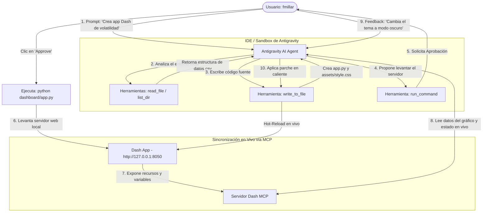

# Integración de Dash y Plotly con Antigravity (Diagrama de Flujo y Ejemplo)

Esta guía explica de forma práctica cómo utilizas el flujo de agentes e interactúas conmigo (**Antigravity**) para construir, ejecutar e iterar tus dashboards en tiempo real, incluyendo el uso del protocolo **MCP**.

---

## 🗺️ Diagrama de Flujo del Ecosistema Antigravity

El siguiente diagrama ilustra el ciclo de vida completo de desarrollo cuando me pides crear o modificar un dashboard de Plotly/Dash en tu máquina local:



---

## 📝 Ejemplo Práctico Paso a Paso (Flujo de Trabajo)

Supongamos que quieres crear un panel de volatilidad de oro (XAU/USD) utilizando este flujo de trabajo. Así es como interactuamos:

### Paso 1: El Prompt Inicial
Me escribes en el chat:
> *"Antigravity, crea una aplicación de Dash en el puerto 8050 que grafique el precio de cierre y el ATR del archivo XAUUSD_PEPPERSTONE_historico.csv en la subcarpeta plotly. Aplica un tema blanco minimalista y tipografía Inter."*

### Paso 2: Análisis e Implementación
1.  Yo utilizo la herramienta `list_dir` para localizar el archivo CSV en tu espacio de trabajo.
2.  Escribo el archivo `app.py` en tu carpeta del proyecto utilizando `write_to_file` con la estructura de Dash, importando `plotly.graph_objects` y aplicando el layout solicitado.

### Paso 3: Propuesta de Ejecución (Aprobación)
Para poner en marcha la aplicación, te propongo un comando de terminal usando la herramienta `run_command`:
```bash
python plotly/app.py
```
*   **Tú controlas el sistema:** El comando no se ejecuta hasta que hagas clic en el botón de **Aprobación** en tu pantalla. 
*   Una vez que lo apruebas, la terminal ejecuta el script y levanta la aplicación en `http://127.0.0.1:8050`.

### Paso 4: Iteración en Caliente (Vibe Coding)
Abres la aplicación en tu navegador y notas que el gráfico se ve bien, pero quieres añadirle dinamismo. Me dices:
> *"Antigravity, agrégale un selector de temporalidad y cambia las líneas de la cuadrícula a un color gris más suave."*

1.  Yo leo el archivo `app.py` actual.
2.  Identifico dónde se define el layout y el callback de Dash.
3.  Modifico únicamente las líneas correspondientes (usando `replace_file_content`).
4.  Como el servidor local de Dash tiene activado el *Hot-Reload* (`debug=True`), la aplicación web en tu navegador **se actualiza automáticamente al instante** sin que tengas que reiniciar la terminal.

### Paso 5: Integración con Dash MCP (Avanzado)
Si tu aplicación de Dash tiene configurada la librería `dash-mcp`:
1.  El dashboard expone un endpoint MCP local.
2.  Yo (Antigravity) me conecto a él.
3.  Si me preguntas: *"¿Qué parámetros del ATR tiene configurados el gráfico actual?"*, yo puedo consultar al servidor Dash MCP en vivo para leer las propiedades de la figura actual y responderte con precisión basada en el estado real del gráfico, sin necesidad de leer el código fuente completo otra vez.
