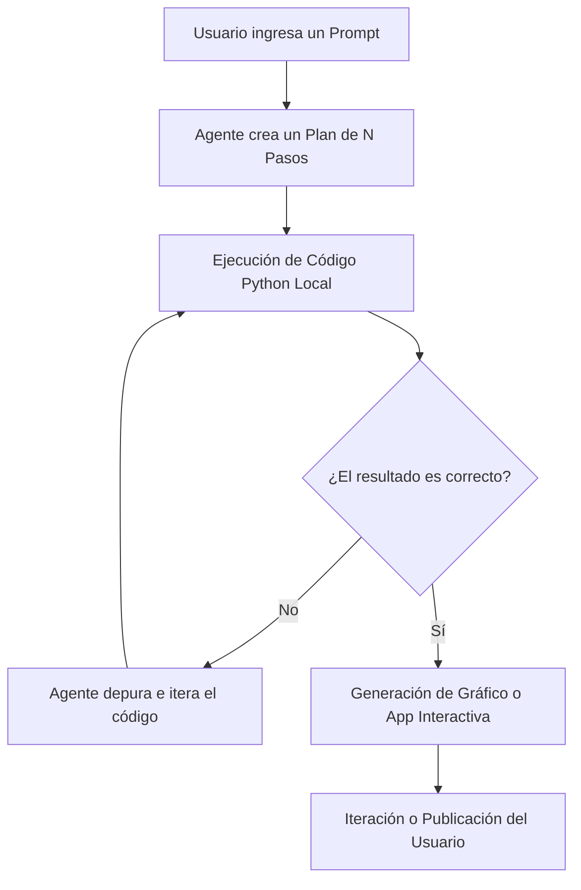

# Guía Maestra: Conexión e Integración de Agentes en Plotly y Dash

Esta guía explica en detalle el funcionamiento, la arquitectura y los pasos para conectarse e integrar **Agentes de Inteligencia Artificial (Agentic Analytics)** en el ecosistema de **Plotly Studio** y **Dash**, utilizando tecnologías modernas como **Model Context Protocol (MCP)**.

---

## 🤖 1. ¿Qué es la Analítica Agente (Agentic Analytics)?

El desarrollo tradicional de dashboards (Business Intelligence o BI) requiere que un humano arrastre componentes visuales, escriba código para conectar bases de datos y configure manualmente cada eje de una gráfica. 

En la **Analítica Agente**, interactúas con un **agente autónomo de IA** (como el flujo agente de Plotly Studio o Antigravity) que puede planificar y ejecutar tareas complejas de múltiples pasos:



### Diferencias Clave:
*   **Interactividad y Verificabilidad:** A diferencia de los chatbots tradicionales (como Claude o ChatGPT web) que devuelven bloques de texto plano estáticos, el agente de analítica genera componentes visuales reales e interactivos (HTML/JS) respaldados por código ejecutable que el usuario puede revisar, modificar y desplegar.
*   **Cero Alucinaciones Numéricas:** Los agentes ejecutan el análisis cuantitativo y los cálculos matemáticos a nivel de backend en un entorno de ejecución local. El LLM solo recibe el esquema (*schema*) y metadatos; las cifras del reporte final son interpoladas directamente de los resultados del código de Python.

---

## 🔌 2. Conectándose a Agentes: ¿Cómo Funciona la Integración?

La conexión entre un agente de IA y un dashboard de datos se realiza a través de interfaces estandarizadas y protocolos de comunicación. La tecnología líder para esto es el **Model Context Protocol (MCP)**.

### ¿Qué es Model Context Protocol (MCP)?
MCP es un estándar abierto desarrollado para que los modelos de lenguaje (LLMs) se conecten de forma segura a fuentes de datos, herramientas y entornos de desarrollo locales o remotos. 

Funciona bajo un modelo Cliente-Servidor:

```
[ Agente / IDE ] (Cliente MCP) <---> [ Protocolo MCP ] <---> [ Base de Datos / App Dash ] (Servidor MCP)
```

En este flujo:
1.  **El Cliente MCP (ej. Antigravity, Claude Code):** Es la interfaz de IA con la que hablas.
2.  **El Servidor MCP (ej. tu Base de datos o App Dash):** Expone recursos (datos, archivos, gráficos) y herramientas (ejecutar consultas, modificar código) que el cliente puede consumir bajo demanda.

---

## 🛠️ 3. El Flujo de Agentes en Plotly y Dash

El ecosistema de Plotly integra agentes de dos formas principales:

### A. El Agente Interno de Plotly Studio
Es el flujo nativo dentro de la aplicación de escritorio de Plotly Studio.
1.  **Conexión de Datos Segura:** Conectas tu base de datos o API. Las credenciales confidenciales se almacenan localmente en el llavero de tu sistema operativo (*OS Keyring*), asegurando que nunca se envíen al servidor del LLM.
2.  **Generación de Plan:** Le pides al agente un análisis específico. Este te devuelve una lista de tareas (ej. 10 pasos) que detalla qué datos consultará y qué gráficos generará.
3.  **Generación de Dash App (Vibe Coding):** El agente consolida el análisis de datos en un script de Dash en Python. Puedes pedirle cambios en lenguaje natural (ej. *"haz el fondo oscuro y remueve las pestañas"*), y el agente alterará el código de la app dinámicamente y la re-renderizará.

### B. Integración Externa mediante "Dash MCP" (El Futuro del Ecosistema)
Esta característica convierte **cualquier aplicación Dash existente en un servidor MCP**. Esto permite que agentes de codificación externos (como tu asistente de IA actual en el IDE) puedan "conectarse" a tu dashboard en vivo.
*   **Recursos Expuestos:** La aplicación Dash le expone al agente la estructura de sus gráficos, el estado de sus datos y las variables actuales del dashboard.
*   **Lógica de Consulta:** Puedes pedirle a tu agente de IA: *"Analiza el gráfico de volatilidad que está corriendo en la app de Dash en el puerto 8050 e identifícame los días con mayor anomalía en el ATR"*. El agente usará el canal MCP para leer los datos de la app Dash en ejecución y darte una respuesta precisa.

---

## 📖 4. Guía de Uso: Cómo interactuar con el Agente de forma Efectiva

Para obtener los mejores resultados al trabajar con agentes de analítica de datos, sigue estas directrices prácticas:

### 1. Define Contexto Claro y Reglas de Negocio
Al redactar tus prompts para el agente, sé específico sobre el origen de los datos y las métricas.
*   *Prompt Ineficaz:* *"Hazme un gráfico con los datos de volatilidad."*
*   *Prompt Eficaz:* *"Conéctate al archivo csv XAUUSD en la carpeta de datos, calcula el ATR de 14 periodos e identifícame los regímenes de volatilidad alta, media y baja según terciles históricos de los últimos 120 días."*

### 2. Utiliza "Skills" (Comandos del Agente)
Las *Skills* son scripts o conjuntos de instrucciones predefinidas que puedes registrar en tu agente para automatizar flujos repetitivos.
*   Puedes crear un comando como `/aplicar-estilo-pepperstone` para indicarle al agente que configure automáticamente el layout del gráfico con la paleta de colores de la corporación, tipografía Inter y márgenes específicos.

### 3. Aprovecha la Iteración Paso a Paso
No intentes que el agente haga todo en un solo prompt gigante.
1.  Pídele primero que **importe y limpie** los datos.
2.  Verifica la tabla resultante en la interfaz.
3.  Pídele que **agregue los cálculos** (ej. ATR).
4.  Pídele que **diseñe las visualizaciones**.
5.  Finalmente, ordénale que **empaquete todo** en un reporte HTML o Dash app.
